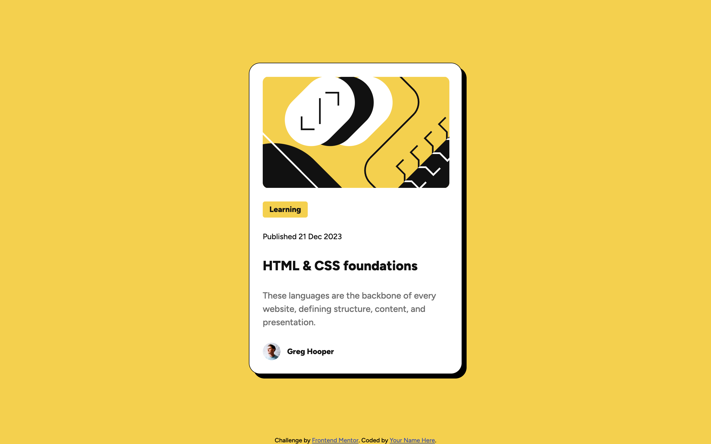

# Frontend Mentor - Blog preview card solution

This is a solution to the [Blog preview card challenge on Frontend Mentor](https://www.frontendmentor.io/challenges/blog-preview-card-ckPaj01IcS). Frontend Mentor challenges help you improve your coding skills by building realistic projects.

## Table of contents

- [Overview](#overview)
  - [The challenge](#the-challenge)
  - [Screenshot](#screenshot)
  - [Links](#links)
- [My process](#my-process)
  - [Built with](#built-with)
  - [What I learned](#what-i-learned)
  - [Continued development](#continued-development)
  - [AI Collaboration](#ai-collaboration)
- [Author](#author)

## Overview

### The challenge

Users should be able to:

- See hover and focus states for all interactive elements on the page

### Screenshot



### Links

- Solution URL: [Add solution URL here](https://your-solution-url.com)
- Live Site URL: [GitHub Pages](https://your-live-site-url.com)

<!-- TODO: fill in once the project is deployed and submitted on Frontend Mentor. -->

## My process

### Built with

- Semantic HTML5 markup
- CSS custom properties (design tokens)
- Flexbox
- CSS nesting
- CSS transitions

### What I learned

**Inline elements and vertical margin**

I learned that vertical margins (`margin-top`/`margin-bottom`) don't create real spacing on inline elements like `<a>`. I initially added `margin-bottom` directly to the title link, but the spacing wasn't showing up in the browser. Moving the margin to the parent `<h2>` (a block-level element) fixed it.

```css
h2 {
  margin-bottom: var(--spacing-150);
}
```

**`:focus-within` for whole-card interactivity**

I learned about `:focus-within`, which lets a parent element react when any of its descendants receive focus. Since the design changes the whole card's shadow and the title's color when hovering anywhere on the card (not just the link), I needed the same behavior for keyboard users — `:hover` alone wouldn't cover that, since the `<article>` itself is never directly focused.

```css
article:hover,
article:focus-within {
  box-shadow: 16px 16px 0 0 #000;
}
```

**Selector specificity across repeated elements**

I learned to be more careful with generic element selectors like `main img`, which unintentionally applied a margin to both the article illustration and the author's avatar image, since both are `` elements inside `<main>`. Adding a specific class to the illustration solved it without affecting the avatar.

```css
.illustration {
  margin-bottom: var(--spacing-300);
}
```

**CSS transitions and timing functions**

I learned how `transition` works: it needs to be declared on the element's base state (not inside `:hover`/`:focus-within`) so the animation applies both when the state activates and when it reverts. I also learned the difference between timing functions like `ease`, `ease-in`, and `ease-out`, and chose `ease-out` for a smoother, more natural "landing" feel on hover.

```css
article {
  box-shadow: 8px 8px 0 0 #000;
  transition: box-shadow 150ms ease-out;
}
```

### Continued development

I would like to continue learning about accessibility, as it's an area I only scratched the surface of with `:focus-within` in this project. I'm also interested in going deeper into CSS transitions and animations, since I found working with timing functions and durations really satisfying. Finally, I want to learn media queries properly, since this project didn't require any and I'd like to be comfortable handling more complex responsive layouts in the future.

### AI Collaboration

I used it primarily as a mentoring tool: we discuss what I want to build, I get asked questions about project decisions instead of being given the code directly, and I get an explanation of the reasoning behind each choice. Compared to my previous project, I noticed I relied less on guided questions this time and wrote more code independently, only asking for help on more specific topics — like animating the card's shadow on hover and understanding timing functions.

What worked well was, once again, reasoning through concepts instead of receiving direct answers — for example, working out why a margin wasn't applying to an inline element. For this particular challenge, I didn't run into any notable friction with this approach.

## Author

- Website - [Abraham Hernandez](https://github.com/javierhrzgt)
- Frontend Mentor - [@javierhrzgt](https://www.frontendmentor.io/profile/javierhrzgt)
- Twitter - [@javierhrzgt](https://www.twitter.com/javierhrzgt)
